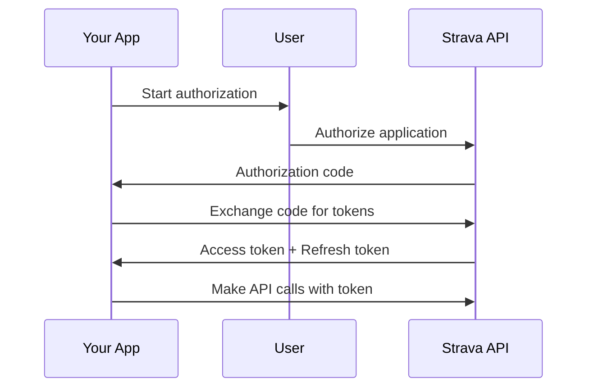

# Authentication Guide

This guide covers authentication with the Strava API using the StravaAPILibary, including OAuth 2.0 flow, token management, and best practices.

## OAuth 2.0 Flow Overview

The StravaAPILibary implements the standard OAuth 2.0 authorization code flow:



## Setting Up Authentication

### 1. Create Strava Application

First, create a Strava application to get your credentials:

1. Visit [Strava API Settings](https://www.strava.com/settings/api)
2. Click **Create Application**
3. Fill in the required fields:
   - **Application Name**: Your app name
   - **Category**: Choose appropriate category
   - **Website**: Your website URL
   - **Authorization Callback Domain**: `localhost` (for development)
4. Click **Create**
5. Note your **Client ID** and **Client Secret**

### 2. Configure Credentials

```csharp
using StravaAPILibary.Authentication;

var credentials = new Credentials(
    "your_client_id",
    "your_client_secret",
    "read,activity:read_all"
);
```

### 3. Initialize Authentication

```csharp
var userAuth = new UserAuthentication(
    credentials,
    "http://localhost:8080/callback",
    "read,activity:read_all"
);
```

## Complete Authentication Flow

### Step 1: Start Authorization

```csharp
// This opens the browser for user authorization
userAuth.StartAuthorization();
```

The user will be redirected to Strava's authorization page where they can:
- Review the requested permissions
- Authorize or deny the application
- Be redirected back to your callback URL

### Step 2: Handle Authorization Code

After authorization, Strava redirects to your callback URL with an authorization code:

```
http://localhost:8080/callback?state=&code=YOUR_AUTHORIZATION_CODE
```

Extract the code from the URL and exchange it for tokens:

```csharp
string authCode = "YOUR_AUTHORIZATION_CODE";
bool success = await userAuth.ExchangeCodeForTokenAsync(authCode);

if (success)
{
    string accessToken = credentials.AccessToken;
    string refreshToken = credentials.RefreshToken;
    DateTime tokenExpiry = credentials.TokenExpiration;
    
    Console.WriteLine("✅ Authentication successful!");
}
```

### Step 3: Use Access Token

```csharp
// Make API calls with the access token
var activities = await Activities.GetAthletesActivitiesAsync(accessToken);
var profile = await Athletes.GetAuthenticatedAthleteProfileAsync(accessToken);
```

## Token Management

### Access Tokens

- **Lifetime**: 6 hours
- **Usage**: Required for all API calls
- **Storage**: Store securely (environment variables, secure storage)

### Refresh Tokens

- **Lifetime**: Indefinite (until revoked)
- **Usage**: Get new access tokens when they expire
- **Storage**: Store securely alongside access tokens

### Automatic Token Refresh

The library can automatically refresh expired tokens:

```csharp
// Check if token needs refresh
if (credentials.TokenExpiration <= DateTime.UtcNow.AddMinutes(5))
{
    bool refreshSuccess = await userAuth.RefreshAccessTokenAsync();
    if (refreshSuccess)
    {
        // Token refreshed successfully
        accessToken = credentials.AccessToken;
    }
}
```

## Scopes and Permissions

### Available Scopes

| Scope | Description | Required for |
|-------|-------------|--------------|
| `read` | Basic profile access | Profile information |
| `activity:read_all` | Read all activities | Activity data |
| `activity:write` | Upload activities | Activity upload |
| `profile:read_all` | Detailed profile access | Detailed profile |
| `profile:write` | Update profile | Profile updates |

### Requesting Scopes

```csharp
// Minimal scope for basic functionality
var credentials = new Credentials(clientId, clientSecret, "read");

// Full scope for complete functionality
var credentials = new Credentials(clientId, clientSecret, "read,activity:read_all,activity:write,profile:read_all");
```

### Scope Best Practices

- **Request minimal scopes** - Only request what you need
- **Explain permissions** - Tell users why you need each scope
- **Handle denied scopes** - Gracefully handle when users deny permissions

## Advanced Authentication Patterns

### 1. Persistent Token Storage

```csharp
public class TokenManager
{
    private readonly string _tokenFilePath = "tokens.json";
    
    public async Task SaveTokensAsync(Credentials credentials)
    {
        var tokenData = new
        {
            AccessToken = credentials.AccessToken,
            RefreshToken = credentials.RefreshToken,
            TokenExpiration = credentials.TokenExpiration,
            Scope = credentials.Scope
        };
        
        string json = JsonSerializer.Serialize(tokenData);
        await File.WriteAllTextAsync(_tokenFilePath, json);
    }
    
    public async Task<Credentials?> LoadTokensAsync(string clientId, string clientSecret)
    {
        if (!File.Exists(_tokenFilePath))
            return null;
            
        string json = await File.ReadAllTextAsync(_tokenFilePath);
        var tokenData = JsonSerializer.Deserialize<TokenData>(json);
        
        if (tokenData == null)
            return null;
            
        var credentials = new Credentials(clientId, clientSecret, tokenData.Scope)
        {
            AccessToken = tokenData.AccessToken,
            RefreshToken = tokenData.RefreshToken,
            TokenExpiration = tokenData.TokenExpiration
        };
        
        return credentials;
    }
}
```

### 2. Automatic Token Refresh

```csharp
public class StravaClient
{
    private readonly Credentials _credentials;
    private readonly UserAuthentication _userAuth;
    
    public StravaClient(string clientId, string clientSecret, string scope)
    {
        _credentials = new Credentials(clientId, clientSecret, scope);
        _userAuth = new UserAuthentication(_credentials, "http://localhost:8080/callback", scope);
    }
    
    public async Task<string> GetValidAccessTokenAsync()
    {
        // Check if token is expired or will expire soon
        if (_credentials.TokenExpiration <= DateTime.UtcNow.AddMinutes(5))
        {
            bool refreshSuccess = await _userAuth.RefreshAccessTokenAsync();
            if (!refreshSuccess)
            {
                throw new InvalidOperationException("Failed to refresh access token");
            }
        }
        
        return _credentials.AccessToken;
    }
    
    public async Task<JsonArray> GetActivitiesAsync()
    {
        string accessToken = await GetValidAccessTokenAsync();
        return await Activities.GetAthletesActivitiesAsync(accessToken);
    }
}
```

### 3. Error Handling

```csharp
public async Task<bool> AuthenticateWithRetryAsync()
{
    int maxRetries = 3;
    int retryCount = 0;
    
    while (retryCount < maxRetries)
    {
        try
        {
            // Try to refresh token first
            if (!string.IsNullOrEmpty(_credentials.RefreshToken))
            {
                bool refreshSuccess = await _userAuth.RefreshAccessTokenAsync();
                if (refreshSuccess)
                {
                    return true;
                }
            }
            
            // If refresh fails, start new authorization
            _userAuth.StartAuthorization();
            
            Console.WriteLine("Please complete authorization in browser...");
            Console.Write("Enter authorization code: ");
            
            string authCode = Console.ReadLine() ?? string.Empty;
            
            if (!string.IsNullOrEmpty(authCode))
            {
                bool success = await _userAuth.ExchangeCodeForTokenAsync(authCode);
                if (success)
                {
                    return true;
                }
            }
            
            retryCount++;
            Console.WriteLine($"Authentication failed. Retry {retryCount}/{maxRetries}");
        }
        catch (Exception ex)
        {
            Console.WriteLine($"Authentication error: {ex.Message}");
            retryCount++;
        }
    }
    
    return false;
}
```

## Security Best Practices

### 1. Secure Token Storage

```csharp
// ❌ Don't store tokens in plain text
File.WriteAllText("tokens.txt", accessToken);

// ✅ Use secure storage
await SecureStorage.SaveAsync("strava_access_token", accessToken);
await SecureStorage.SaveAsync("strava_refresh_token", refreshToken);
```

### 2. Environment Variables

```csharp
// Load credentials from environment variables
string clientId = Environment.GetEnvironmentVariable("STRAVA_CLIENT_ID") 
    ?? throw new InvalidOperationException("STRAVA_CLIENT_ID not set");
    
string clientSecret = Environment.GetEnvironmentVariable("STRAVA_CLIENT_SECRET") 
    ?? throw new InvalidOperationException("STRAVA_CLIENT_SECRET not set");
```

### 3. Token Validation

```csharp
public bool IsTokenValid(Credentials credentials)
{
    return !string.IsNullOrEmpty(credentials.AccessToken) &&
           credentials.TokenExpiration > DateTime.UtcNow.AddMinutes(5);
}
```

## Troubleshooting

### Common Issues

**"Invalid authorization code"**
- Authorization codes expire quickly (usually within 10 minutes)
- Ensure the code is copied correctly from the URL
- Check that your redirect URI matches your Strava app settings

**"Access token is invalid"**
- Access tokens expire after 6 hours
- Use the refresh token to get a new access token
- Verify the token hasn't been revoked by the user

**"Refresh token is invalid"**
- Refresh tokens can be revoked by users
- Users can revoke access in their Strava settings
- You'll need to re-authenticate the user

**"Insufficient scope"**
- The requested operation requires a scope not granted
- Check the required scopes for the API call
- Request the appropriate scope during authorization

### Debug Information

```csharp
public void LogTokenInfo(Credentials credentials)
{
    Console.WriteLine($"Access Token: {credentials.AccessToken[..10]}...");
    Console.WriteLine($"Refresh Token: {credentials.RefreshToken[..10]}...");
    Console.WriteLine($"Token Expires: {credentials.TokenExpiration}");
    Console.WriteLine($"Scope: {credentials.Scope}");
    Console.WriteLine($"Is Expired: {credentials.TokenExpiration <= DateTime.UtcNow}");
}
```

## Next Steps

- **[API Reference](~/docs/api/)** - Complete API documentation
- **[Examples](examples.md)** - Authentication examples
- **[Best Practices](best-practices.md)** - Security and performance tips

---

**Secure authentication is the foundation of great Strava applications! 🔐** 